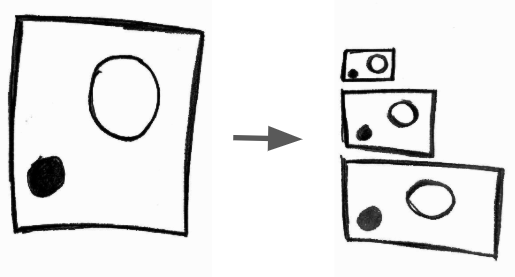

# Common video operations

#### Transcoding

<p align="center">
    
</p>

**What?** the act of converting one of the streams \(audio or video\) from one CODEC to another one.

**Why?** sometimes some devices \(TVs, smartphones, console and etc\) doesn't support X but Y and newer CODECs provide better compression rate.

**How?** converting an `H264` \(AVC\) video to an `H265` \(HEVC\).

```bash
$ ffmpeg \
-i bunny_1080p_60fps.mp4 \
-c:v libx265 \
bunny_1080p_60fps_h265.mp4
```

#### Transmuxing


**What?** the act of converting from one format \(container\) to another one.

**Why?** sometimes some devices \(TVs, smartphones, console and etc\) doesn't support X but Y and sometimes newer containers provide modern required features.

**How?** converting a `mp4` to a `webm`.

```bash
$ ffmpeg \
-i bunny_1080p_60fps.mp4 \
-c copy \ # just saying to ffmpeg to skip encoding
bunny_1080p_60fps.webm
```

#### Transrating


**What?** the act of changing the bit rate, or producing other renditions.

**Why?** people will try to watch your video in a `2G` \(edge\) connection using a less powerful smartphone or in a `fiber` Internet connection on their 4K TVs therefore you should offer more than on rendition of the same video with different bit rate.

**How?** producing a rendition with bit rate between 3856K and 2000K.

```bash
$ ffmpeg \
-i bunny_1080p_60fps.mp4 \
-minrate 964K -maxrate 3856K -bufsize 2000K \
bunny_1080p_60fps_transrating_964_3856.mp4
```

Usually we'll be using transrating with transsizing. Werner Robitza wrote another must read/execute [series of posts about FFmpeg rate control](http://slhck.info/posts/).

#### Transsizing



**What?** the act of converting from one resolution to another one. As said before transsizing is often used with transrating.

**Why?** reasons are about the same as for the transrating.

**How?** converting a `1080p` to a `480p` resolution.

```bash
$ ffmpeg \
-i bunny_1080p_60fps.mp4 \
-vf scale=480:-1 \
bunny_1080p_60fps_transsizing_480.mp4
```

#### Bonus Round: Adaptive Streaming


**What?** the act of producing many resolutions \(bit rates\) and split the media into chunks and serve them via http.

**Why?** to provide a flexible media that can be watched on a low end smartphone or on a 4K TV, it's also easy to scale and deploy but it can add latency.

**How?** creating an adaptive WebM using DASH.

```bash
# video streams
$ ffmpeg -i bunny_1080p_60fps.mp4 -c:v libvpx-vp9 -s 160x90 -b:v 250k -keyint_min 150 -g 150 -an -f webm -dash 1 video_160x90_250k.webm

$ ffmpeg -i bunny_1080p_60fps.mp4 -c:v libvpx-vp9 -s 320x180 -b:v 500k -keyint_min 150 -g 150 -an -f webm -dash 1 video_320x180_500k.webm

$ ffmpeg -i bunny_1080p_60fps.mp4 -c:v libvpx-vp9 -s 640x360 -b:v 750k -keyint_min 150 -g 150 -an -f webm -dash 1 video_640x360_750k.webm

$ ffmpeg -i bunny_1080p_60fps.mp4 -c:v libvpx-vp9 -s 640x360 -b:v 1000k -keyint_min 150 -g 150 -an -f webm -dash 1 video_640x360_1000k.webm

$ ffmpeg -i bunny_1080p_60fps.mp4 -c:v libvpx-vp9 -s 1280x720 -b:v 1500k -keyint_min 150 -g 150 -an -f webm -dash 1 video_1280x720_1500k.webm

# audio streams
$ ffmpeg -i bunny_1080p_60fps.mp4 -c:a libvorbis -b:a 128k -vn -f webm -dash 1 audio_128k.webm

# the DASH manifest
$ ffmpeg \
 -f webm_dash_manifest -i video_160x90_250k.webm \
 -f webm_dash_manifest -i video_320x180_500k.webm \
 -f webm_dash_manifest -i video_640x360_750k.webm \
 -f webm_dash_manifest -i video_640x360_1000k.webm \
 -f webm_dash_manifest -i video_1280x720_500k.webm \
 -f webm_dash_manifest -i audio_128k.webm \
 -c copy -map 0 -map 1 -map 2 -map 3 -map 4 -map 5 \
 -f webm_dash_manifest \
 -adaptation_sets "id=0,streams=0,1,2,3,4 id=1,streams=5" \
 manifest.mpd
```

PS: I stole this example from the [Instructions to playback Adaptive WebM using DASH](http://wiki.webmproject.org/adaptive-streaming/instructions-to-playback-adaptive-webm-using-dash)

#### Going beyond

There are [many and many other usages for FFmpeg](https://github.com/leandromoreira/digital_video_introduction/blob/master/encoding_pratical_examples.md#split-and-merge-smoothly). I use it in conjunction with _iMovie_ to produce/edit some videos for YouTube and you can certainly use it professionally.

