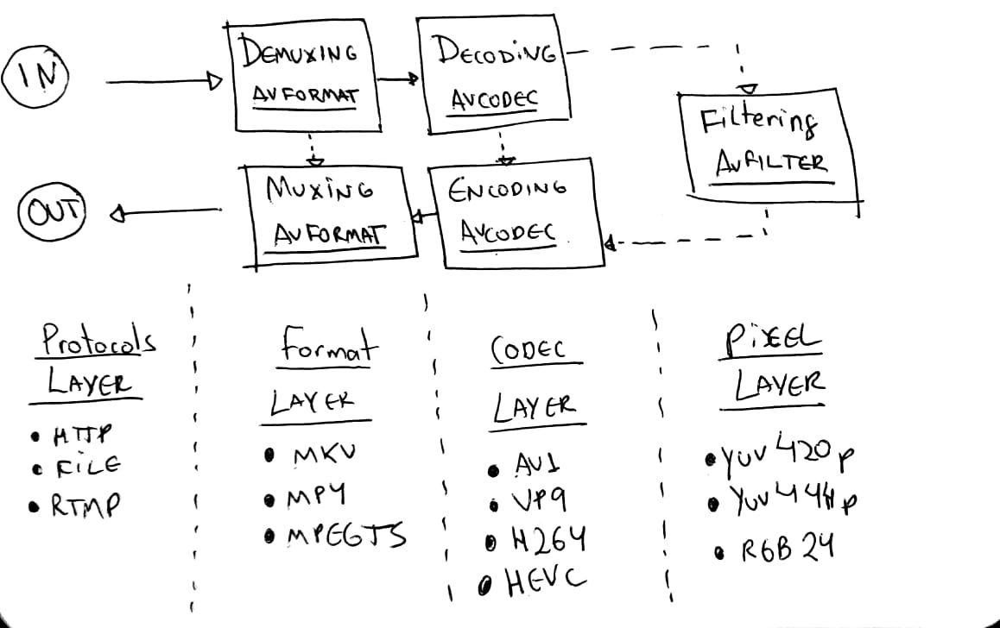

# Learn FFmpeg libav the Hard Way

>Don't you wonder sometimes 'bout sound and vision? David Robert Jones

Since the [FFmpeg](ffmpeg-command-line.md) is so useful as a command line tool to do essential tasks over the media files, how can we use it in our programs?

FFmpeg is [composed by several libraries](https://www.ffmpeg.org/doxygen/trunk/index.html) that can be integrated into our own programs. Usually, when you install FFmpeg, it installs automatically all these libraries. I'll be referring to the set of these libraries as FFmpeg libav.

>This title is a homage to Zed Shaw's series [Learn X the Hard Way](https://learncodethehardway.org/), particularly his book Learn C the Hard Way.

## Chapter 0 - The infamous hello world

This hello world actually won't show the message "hello world" in the terminal 👅 Instead we're going to print out information about the video, things like its format (container), duration, resolution, audio channels and, in the end, we'll decode some frames and save them as image files.

### FFmpeg libav architecture

But before we start to code, let's learn how FFmpeg libav architecture works and how its components communicate with others.

Here's a diagram of the process of decoding a video:

<p align="center">
    
</p>

You'll first need to load your media file into a component called [AVFormatContext](https://ffmpeg.org/doxygen/trunk/structAVFormatContext.html) (the video container is also known as format). It actually doesn't fully load the whole file: it often only reads the header.

Once we loaded the minimal __header of our container__, we can access its streams (think of them as a rudimentary audio and video data). Each stream will be available in a component called [AVStream](https://ffmpeg.org/doxygen/trunk/structAVStream.html).

>Stream is a fancy name for a continuous flow of data

Suppose our video has two streams: an audio encoded with [AAC CODEC](https://en.wikipedia.org/wiki/Advanced_Audio_Coding) and a video encoded with [H264 (AVC) CODEC](https://en.wikipedia.org/wiki/H.264/MPEG-4_AVC). From each stream we can extract pieces (slices) of data called packets that will be loaded into components named [AVPacket](https://ffmpeg.org/doxygen/trunk/structAVPacket.html).

The __data inside the packets are still coded__ (compressed) and in order to decode the packets, we need to pass them to a specific [AVCodec](https://ffmpeg.org/doxygen/trunk/structAVCodec.html).

The AVCodec will decode them into [AVFrame](https://ffmpeg.org/doxygen/trunk/structAVFrame.html) and finally, this component gives us __the uncompressed frame__. Noticed that the same terminology/process is used either by audio and video stream

### Requirements

Since some people were [facing issues while compiling or running the examples](https://github.com/leandromoreira/ffmpeg-libav-tutorial/issues?utf8=✓&q=is%3Aissue+is%3Aopen+compiling) __we're going to use [Docker](https://docs.docker.com/install/) as our development/runner environment__, we'll also use the big buck bunny video so if you don't have it locally just run the command `make fetch_small_bunny_video`.

## Chapter 1 - Code walkthrough

>__show me the [code](https://github.com/namndev/FFmpegTutorial/blob/master/0_hello_world.c) and execution__.
>```bash
>$ make run_hello
>```

We'll skip some details, but don't worry: [the source code is available at github](https://github.com/namndev/FFmpegTutorial/blob/master/0_hello_world.c).

We're going to allocate memory to the component [`AVFormatContext`](http://ffmpeg.org/doxygen/trunk/structAVFormatContext.html) that will hold information about the format (container).

```c
AVFormatContext *pFormatContext = avformat_alloc_context();
```

Now we're going to open the file and read its header and fill the `AVFormatContext` with minimal information about the format (notice that usually the codecs are not opened). The function used to do this is [`avformat_open_input`](http://ffmpeg.org/doxygen/trunk/group__lavf__decoding.html#ga31d601155e9035d5b0e7efedc894ee49). It expects an `AVFormatContext`, a `filename` and two optional arguments: the [`AVInputFormat`](https://ffmpeg.org/doxygen/trunk/structAVInputFormat.html) (if you pass `NULL`, FFmpeg will guess the format) and the [`AVDictionary`](https://ffmpeg.org/doxygen/trunk/structAVDictionary.html) (which are the options to the demuxer).

```c
avformat_open_input(&pFormatContext, filename, NULL, NULL);
```

We can print the format name and the media duration:

```c
printf("Format %s, duration %lld us", pFormatContext->iformat->long_name, pFormatContext->duration);
```

To access the `streams`, we need to read data from the media. The function [`avformat_find_stream_info`](https://ffmpeg.org/doxygen/trunk/group__lavf__decoding.html#gad42172e27cddafb81096939783b157bb) does that. Now, the `pFormatContext->nb_streams` will hold the amount of streams and the `pFormatContext->streams[i]` will give us the `i` stream (an [`AVStream`](https://ffmpeg.org/doxygen/trunk/structAVStream.html)).

```c
avformat_find_stream_info(pFormatContext,  NULL);
```

Now we'll loop through all the streams.

```c
for (int i = 0; i < pFormatContext->nb_streams; i++)
{
  //
}
```

For each stream, we're going to keep the [`AVCodecParameters`](https://ffmpeg.org/doxygen/trunk/structAVCodecParameters.html), which describes the properties of a codec used by the stream `i`.

```c
AVCodecParameters *pLocalCodecParameters = pFormatContext->streams[i]->codecpar;
```

With the codec properties we can look up the proper CODEC querying the function [`avcodec_find_decoder`](https://ffmpeg.org/doxygen/trunk/group__lavc__decoding.html#ga19a0ca553277f019dd5b0fec6e1f9dca) and find the registered decoder for the codec id and return an [`AVCodec`](http://ffmpeg.org/doxygen/trunk/structAVCodec.html), the component that knows how to enCOde and DECode the stream.

```c
AVCodec *pLocalCodec = avcodec_find_decoder(pLocalCodecParameters->codec_id);
```

Now we can print information about the codecs.

```c
// specific for video and audio
if (pLocalCodecParameters->codec_type == AVMEDIA_TYPE_VIDEO) {
  printf("Video Codec: resolution %d x %d", pLocalCodecParameters->width, pLocalCodecParameters->height);
} else if (pLocalCodecParameters->codec_type == AVMEDIA_TYPE_AUDIO) {
  printf("Audio Codec: %d channels, sample rate %d", pLocalCodecParameters->channels, pLocalCodecParameters->sample_rate);
}
// general
printf("\tCodec %s ID %d bit_rate %lld", pLocalCodec->long_name, pLocalCodec->id, pCodecParameters->bit_rate);
```

With the codec, we can allocate memory for the [`AVCodecContext`](https://ffmpeg.org/doxygen/trunk/structAVCodecContext.html), which will hold the context for our decode/encode process, but then we need to fill this codec context with CODEC parameters; we do that with [`avcodec_parameters_to_context`](https://ffmpeg.org/doxygen/trunk/group__lavc__core.html#gac7b282f51540ca7a99416a3ba6ee0d16).

Once we filled the codec context, we need to open the codec. We call the function [`avcodec_open2`](https://ffmpeg.org/doxygen/trunk/group__lavc__core.html#ga11f785a188d7d9df71621001465b0f1d) and then we can use it.

```c
AVCodecContext *pCodecContext = avcodec_alloc_context3(pCodec);
avcodec_parameters_to_context(pCodecContext, pCodecParameters);
avcodec_open2(pCodecContext, pCodec, NULL);
```

Now we're going to read the packets from the stream and decode them into frames but first, we need to allocate memory for both components, the [`AVPacket`](https://ffmpeg.org/doxygen/trunk/structAVPacket.html) and [`AVFrame`](https://ffmpeg.org/doxygen/trunk/structAVFrame.html).

```c
AVPacket *pPacket = av_packet_alloc();
AVFrame *pFrame = av_frame_alloc();
```

Let's feed our packets from the streams with the function [`av_read_frame`](https://ffmpeg.org/doxygen/trunk/group__lavf__decoding.html#ga4fdb3084415a82e3810de6ee60e46a61) while it has packets.

```c
while (av_read_frame(pFormatContext, pPacket) >= 0) {
  //...
}
```

Let's __send the raw data packet__ (compressed frame) to the decoder, through the codec context, using the function [`avcodec_send_packet`](https://ffmpeg.org/doxygen/trunk/group__lavc__decoding.html#ga58bc4bf1e0ac59e27362597e467efff3).

```c
avcodec_send_packet(pCodecContext, pPacket);
```

And let's __receive the raw data frame__ (uncompressed frame) from the decoder, through the same codec context, using the function [`avcodec_receive_frame`](https://ffmpeg.org/doxygen/trunk/group__lavc__decoding.html#ga11e6542c4e66d3028668788a1a74217c).

avcodec_receive_frame(pCodecContext, pFrame);
We can print the frame number, the [PTS](https://en.wikipedia.org/wiki/Presentation_timestamp), DTS, [frame type](https://en.wikipedia.org/wiki/Video_compression_picture_types) and etc.

```c
printf(
    "Frame %c (%d) pts %d dts %d key_frame %d [coded_picture_number %d, display_picture_number %d]",
    av_get_picture_type_char(pFrame->pict_type),
    pCodecContext->frame_number,
    pFrame->pts,
    pFrame->pkt_dts,
    pFrame->key_frame,
    pFrame->coded_picture_number,
    pFrame->display_picture_number
);
```

Finally we can save our decoded frame into a [simple gray image](https://en.wikipedia.org/wiki/Netpbm_format#PGM_example). The process is very simple, we'll use the `pFrame->data` where the index is related to the [planes Y, Cb and Cr](https://en.wikipedia.org/wiki/YCbCr), we just picked `0` (Y) to save our gray image.

```c
save_gray_frame(pFrame->data[0], pFrame->linesize[0], pFrame->width, pFrame->height, frame_filename);

static void save_gray_frame(unsigned char *buf, int wrap, int xsize, int ysize, char *filename)
{
    FILE *f;
    int i;
    f = fopen(filename,"w");
    // writing the minimal required header for a pgm file format
    // portable graymap format -> https://en.wikipedia.org/wiki/Netpbm_format#PGM_example
    fprintf(f, "P5\n%d %d\n%d\n", xsize, ysize, 255);

    // writing line by line
    for (i = 0; i < ysize; i++)
        fwrite(buf + i * wrap, 1, xsize, f);
    fclose(f);
}
```

And here! Now we have a gray scale image with 2MB:

<p align="center">
    
</p>

## Chapter 2 - Syncing audio and video

>__Be the player__ - a young JS developer writing a new MSE video player.

Before we move to [code a transcoding example](https://github.com/namndev/FFmpegTutorial#chapter-2---transcoding) let's talk about timing, or how a video player knows the right time to play a frame.

In the last example, we saved some frames that can be seen here:

<p align="center">
    
    
    
    
    
    
</p>

When we're designing a video player we need to __play each frame at a given pace__, otherwise it would be hard to pleasantly see the video either because it's playing so fast or so slow.

Therefore we need to introduce some logic to play each frame smoothly. For that matter, each frame has a __presentation timestamp__ (PTS) which is an increasing number factored in a timebase that is a rational number (where the denominator is known as __timescale__) divisible by the __frame rate (fps)__.

It's easier to understand when we look at some examples, let's simulate some scenarios.

For a `fps=60/1` and `timebase=1/60000` each PTS will increase `timescale / fps = 1000` therefore the __PTS real time__ for each frame could be (supposing it started at 0):

- `frame=0, PTS = 0, PTS_TIME = 0`
- `frame=1, PTS = 1000, PTS_TIME = PTS * timebase = 0.016`
- `frame=2, PTS = 2000, PTS_TIME = PTS * timebase = 0.033`

For almost the same scenario but with a timebase equal to `1/60`.

- `frame=0, PTS = 0, PTS_TIME = 0`
- `frame=1, PTS = 1, PTS_TIME = PTS * timebase = 0.016`
- `frame=2, PTS = 2, PTS_TIME = PTS * timebase = 0.033`
- `frame=3, PTS = 3, PTS_TIME = PTS * timebase = 0.050`

For a `fps=25/1` and `timebase=1/75` each PTS will increase `timescale / fps = 3` and the PTS time could be:

- `frame=0, PTS = 0, PTS_TIME = 0`
- `frame=1, PTS = 3, PTS_TIME = PTS * timebase = 0.04`
- `frame=2, PTS = 6, PTS_TIME = PTS * timebase = 0.08`
- `frame=3, PTS = 9, PTS_TIME = PTS * timebase = 0.12`
- ...
- `frame=24, PTS = 72, PTS_TIME = PTS * timebase = 0.96`
- ...
- `frame=4064, PTS = 12192, PTS_TIME = PTS * timebase = 162.56`

Now with the `pts_time` we can find a way to render this synched with audio `pts_time` or with a system clock. The FFmpeg libav provides these info through its API:

- fps = [`AVStream->avg_frame_rate`](https://ffmpeg.org/doxygen/trunk/structAVStream.html#a946e1e9b89eeeae4cab8a833b482c1ad)
- tbr = [`AVStream->r_frame_rate`](https://ffmpeg.org/doxygen/trunk/structAVStream.html#ad63fb11cc1415e278e09ddc676e8a1ad)
- tbn = [`AVStream->time_base`](https://ffmpeg.org/doxygen/trunk/structAVStream.html#a9db755451f14e2bf590d4b85d82b32e6)

Just out of curiosity, the frames we saved were sent in a DTS order (frames: 1,6,4,2,3,5) but played at a PTS order (frames: 1,2,3,4,5). Also, notice how cheap are B-Frames in comparison to P or I-Frames.

```bash
LOG: AVStream->r_frame_rate 60/1
LOG: AVStream->time_base 1/60000
...
LOG: Frame 1 (type=I, size=153797 bytes) pts 6000 key_frame 1 [DTS 0]
LOG: Frame 2 (type=B, size=8117 bytes) pts 7000 key_frame 0 [DTS 3]
LOG: Frame 3 (type=B, size=8226 bytes) pts 8000 key_frame 0 [DTS 4]
LOG: Frame 4 (type=B, size=17699 bytes) pts 9000 key_frame 0 [DTS 2]
LOG: Frame 5 (type=B, size=6253 bytes) pts 10000 key_frame 0 [DTS 5]
LOG: Frame 6 (type=P, size=34992 bytes) pts 11000 key_frame 0 [DTS 1]
```

## Chapter 3 - Remuxing

Remuxing is the act of changing from one format (container) to another, for instance, we can change a MPEG-4 video to a MPEG-TS one without much pain using FFmpeg:

```bash
ffmpeg input.mp4 -c copy output.ts
```

It'll demux the mp4 but it won't decode or encode it (`-c copy`) and in the end, it'll mux it into a `mpegts` file. If you don't provide the format `-f` the ffmpeg will try to guess it based on the file's extension.

The general usage of FFmpeg or the libav follows a pattern/architecture or workflow:

- [__protocol layer__](https://ffmpeg.org/doxygen/trunk/protocols_8c.html) - it accepts an `input` (a `file` for instance but it could be a `rtmp` or `HTTP` input as well)
- [__format layer__](https://ffmpeg.org/doxygen/trunk/group__libavf.html) - it `demuxes` its content, revealing mostly metadata and its streams
- [__codec layer__](https://ffmpeg.org/doxygen/trunk/group__libavc.html) - it `decodes` its compressed streams data <sup>*optional*</sup>
- [__pixel layer__](https://ffmpeg.org/doxygen/trunk/group__lavfi.html) - it can also apply some `filters` to the raw frames (like resizing)<sup>*optional*</sup> and then it does the reverse path
- [__codec layer__](https://ffmpeg.org/doxygen/trunk/group__libavc.html) - it `encodes` (or `re-encodes` or even `transcodes`) the raw frames<sup>*optional*</sup>
- [__format layer__](https://ffmpeg.org/doxygen/trunk/group__libavf.html) - it `muxes` (or `remuxes`) the raw streams (the compressed data)
- [__protocol layer__](https://ffmpeg.org/doxygen/trunk/protocols_8c.html) - and finally the muxed data is sent to an `output` (another file or maybe a network remote server)

<p align="center">
  
</p>

> This graph is strongly inspired by [Leixiaohua's](http://leixiaohua1020.github.io/#ffmpeg-development-examples) and [Slhck's](https://slhck.info/ffmpeg-encoding-course/#/9) works.

Now let's code an example using libav to provide the same effect as in `ffmpeg input.mp4 -c copy output.ts`.

We're going to read from an input (`input_format_context`) and change it to another output (`output_format_context`).

```c
AVFormatContext *input_format_context = NULL;
AVFormatContext *output_format_context = NULL;
```

We start doing the usually allocate memory and open the input format. For this specific case, we're going to open an input file and allocate memory for an output file.

```c
if ((ret = avformat_open_input(&input_format_context, in_filename, NULL, NULL)) < 0) {
  fprintf(stderr, "Could not open input file '%s'", in_filename);
  goto end;
}
if ((ret = avformat_find_stream_info(input_format_context, NULL)) < 0) {
  fprintf(stderr, "Failed to retrieve input stream information");
  goto end;
}

avformat_alloc_output_context2(&output_format_context, NULL, NULL, out_filename);
if (!output_format_context) {
  fprintf(stderr, "Could not create output context\n");
  ret = AVERROR_UNKNOWN;
  goto end;
}
```

We're going to remux only the video, audio and subtitle types of streams so we're holding what streams we'll be using into an array of indexes.

```c
number_of_streams = input_format_context->nb_streams;
streams_list = av_mallocz_array(number_of_streams, sizeof(*streams_list));
```

Just after we allocated the required memory, we're going to loop throughout all the streams and for each one we need to create new out stream into our output format context, using the [avformat_new_stream](https://ffmpeg.org/doxygen/trunk/group__lavf__core.html#gadcb0fd3e507d9b58fe78f61f8ad39827) function. Notice that we're marking all the streams that aren't video, audio or subtitle so we can skip them after.

```c
for (i = 0; i < input_format_context->nb_streams; i++) {
  AVStream *out_stream;
  AVStream *in_stream = input_format_context->streams[i];
  AVCodecParameters *in_codecpar = in_stream->codecpar;
  if (in_codecpar->codec_type != AVMEDIA_TYPE_AUDIO &&
      in_codecpar->codec_type != AVMEDIA_TYPE_VIDEO &&
      in_codecpar->codec_type != AVMEDIA_TYPE_SUBTITLE) {
    streams_list[i] = -1;
    continue;
  }
  streams_list[i] = stream_index++;
  out_stream = avformat_new_stream(output_format_context, NULL);
  if (!out_stream) {
    fprintf(stderr, "Failed allocating output stream\n");
    ret = AVERROR_UNKNOWN;
    goto end;
  }
  ret = avcodec_parameters_copy(out_stream->codecpar, in_codecpar);
  if (ret < 0) {
    fprintf(stderr, "Failed to copy codec parameters\n");
    goto end;
  }
}
```

Now we can create the output file.

```c
if (!(output_format_context->oformat->flags & AVFMT_NOFILE)) {
  ret = avio_open(&output_format_context->pb, out_filename, AVIO_FLAG_WRITE);
  if (ret < 0) {
    fprintf(stderr, "Could not open output file '%s'", out_filename);
    goto end;
  }
}

ret = avformat_write_header(output_format_context, NULL);
if (ret < 0) {
  fprintf(stderr, "Error occurred when opening output file\n");
  goto end;
}
```

After that, we can copy the streams, packet by packet, from our input to our output streams. We'll loop while it has packets (`av_read_frame`), for each packet we need to re-calculate the PTS and DTS to finally write it (`av_interleaved_write_frame`) to our output format context.

```c
while (1) {
  AVStream *in_stream, *out_stream;
  ret = av_read_frame(input_format_context, &packet);
  if (ret < 0)
    break;
  in_stream  = input_format_context->streams[packet.stream_index];
  if (packet.stream_index >= number_of_streams || streams_list[packet.stream_index] < 0) {
    av_packet_unref(&packet);
    continue;
  }
  packet.stream_index = streams_list[packet.stream_index];
  out_stream = output_format_context->streams[packet.stream_index];
  /* copy packet */
  packet.pts = av_rescale_q_rnd(packet.pts, in_stream->time_base, out_stream->time_base, AV_ROUND_NEAR_INF|AV_ROUND_PASS_MINMAX);
  packet.dts = av_rescale_q_rnd(packet.dts, in_stream->time_base, out_stream->time_base, AV_ROUND_NEAR_INF|AV_ROUND_PASS_MINMAX);
  packet.duration = av_rescale_q(packet.duration, in_stream->time_base, out_stream->time_base);
  // https://ffmpeg.org/doxygen/trunk/structAVPacket.html#ab5793d8195cf4789dfb3913b7a693903
  packet.pos = -1;

  //https://ffmpeg.org/doxygen/trunk/group__lavf__encoding.html#ga37352ed2c63493c38219d935e71db6c1
  ret = av_interleaved_write_frame(output_format_context, &packet);
  if (ret < 0) {
    fprintf(stderr, "Error muxing packet\n");
    break;
  }
  av_packet_unref(&packet);
}
```

To finalize we need to write the stream trailer to an output media file with [av_write_trailer](https://ffmpeg.org/doxygen/trunk/group__lavf__encoding.html#ga7f14007e7dc8f481f054b21614dfec13) function.

```c
av_write_trailer(output_format_context);
```

Now we're ready to test it and the first test will be a format (video container) conversion from a MP4 to a MPEG-TS video file. We're basically making the command line `ffmpeg input.mp4 -c copy output.ts` with libav.

```bash
make run_remuxing_ts
```

It's working!!! don't you trust me?! you shouldn't, we can check it with `ffprobe`:

```bash
ffprobe -i remuxed_small_bunny_1080p_60fps.ts

Input #0, mpegts, from 'remuxed_small_bunny_1080p_60fps.ts':
  Duration: 00:00:10.03, start: 0.000000, bitrate: 2751 kb/s
  Program 1
    Metadata:
      service_name    : Service01
      service_provider: FFmpeg
    Stream #0:0[0x100]: Video: h264 (High) ([27][0][0][0] / 0x001B), yuv420p(progressive), 1920x1080 [SAR 1:1 DAR 16:9], 60 fps, 60 tbr, 90k tbn, 120 tbc
    Stream #0:1[0x101]: Audio: ac3 ([129][0][0][0] / 0x0081), 48000 Hz, 5.1(side), fltp, 320 kb/s
```

To sum up what we did here in a graph, we can revisit our initial [idea about how libav works](https://github.com/leandromoreira/ffmpeg-libav-tutorial#ffmpeg-libav-architecture) but showing that we skipped the codec part.

<p align="center">
  
</p>

Before we end this chapter I'd like to show an important part of the remuxing process, **you can pass options to the muxer**. Let's say we want to delivery [MPEG-DASH](https://developer.mozilla.org/en-US/docs/Web/Apps/Fundamentals/Audio_and_video_delivery/Setting_up_adaptive_streaming_media_sources#MPEG-DASH_Encoding) format for that matter we need to use [fragmented mp4](https://stackoverflow.com/a/35180327) (sometimes referred as `fmp4`) instead of MPEG-TS or plain MPEG-4.

With the [command line we can do that easily](https://developer.mozilla.org/en-US/docs/Web/API/Media_Source_Extensions_API/Transcoding_assets_for_MSE#Fragmenting).

```
ffmpeg -i non_fragmented.mp4 -movflags frag_keyframe+empty_moov+default_base_moof fragmented.mp4
```

Almost equally easy as the command line is the libav version of it, we just need to pass the options when write the output header, just before the packets copy.

```c
AVDictionary* opts = NULL;
av_dict_set(&opts, "movflags", "frag_keyframe+empty_moov+default_base_moof", 0);
ret = avformat_write_header(output_format_context, &opts);
```

We now can generate this fragmented mp4 file:

```bash
make run_remuxing_fragmented_mp4
```

But to make sure that I'm not lying to you. You can use the amazing site/tool [gpac/mp4box.js](http://download.tsi.telecom-paristech.fr/gpac/mp4box.js/filereader.html) or the site [http://mp4parser.com/](http://mp4parser.com/) to see the differences, first load up the "common" mp4.

<p align="center">
  
</p>

As you can see it has a single `mdat` atom/box, **this is place where the video and audio frames are**. Now load the fragmented mp4 to see which how it spreads the `mdat` boxes.

<p align="center">
  
</p>

## Chapter 4 - Transcoding

> show me the [code](https://github.com/namndev/FFmpegTutorial/blob/master/3_transcoding.c) and execution.
> ```bash
> $ make run_transcoding
> ```
> We'll skip some details, but don't worry: the [source code is available at github](https://github.com/namndev/FFmpegTutorial/blob/master/3_transcoding.c).


In this chapter, we're going to create a minimalist transcoder, written in C, that can convert videos coded in H264 to H265 using **FFmpeg/libav** library specifically [libavcodec](https://ffmpeg.org/libavcodec.html), libavformat, and libavutil.

<p align="center">
  
</p>

> _Just a quick recap:_ The [**AVFormatContext**](https://www.ffmpeg.org/doxygen/trunk/structAVFormatContext.html) is the abstraction for the format of the media file, aka container (ex: MKV, MP4, Webm, TS). The [**AVStream**](https://www.ffmpeg.org/doxygen/trunk/structAVStream.html) represents each type of data for a given format (ex: audio, video, subtitle, metadata). The [**AVPacket**](https://www.ffmpeg.org/doxygen/trunk/structAVPacket.html) is a slice of compressed data obtained from the `AVStream` that can be decoded by an [**AVCodec**](https://www.ffmpeg.org/doxygen/trunk/structAVCodec.html) (ex: av1, h264, vp9, hevc) generating a raw data called [**AVFrame**](https://www.ffmpeg.org/doxygen/trunk/structAVFrame.html).

### Transmuxing

Let's start with the simple transmuxing operation and then we can build upon this code, the first step is to **load the input file**.

```c
// Allocate an AVFormatContext
avfc = avformat_alloc_context();
// Open an input stream and read the header.
avformat_open_input(avfc, in_filename, NULL, NULL);
// Read packets of a media file to get stream information.
avformat_find_stream_info(avfc, NULL);
```

Now we're going to set up the decoder, the `AVFormatContext` will give us access to all the `AVStream` components and for each one of them, we can get their `AVCodec` and create the particular `AVCodecContext` and finally we can open the given codec so we can proceed to the decoding process.

>  The [**AVCodecContext**](https://www.ffmpeg.org/doxygen/trunk/structAVCodecContext.html) holds data about media configuration such as bit rate, frame rate, sample rate, channels, height, and many others.

```c
for (int i = 0; i < avfc->nb_streams; i++)
{
  AVStream *avs = avfc->streams[i];
  AVCodec *avc = avcodec_find_decoder(avs->codecpar->codec_id);
  AVCodecContext *avcc = avcodec_alloc_context3(*avc);
  avcodec_parameters_to_context(*avcc, avs->codecpar);
  avcodec_open2(*avcc, *avc, NULL);
}
```

We need to prepare the output media file for transmuxing as well, we first **allocate memory** for the output `AVFormatContext`. We create **each stream** in the output format. In order to pack the stream properly, we **copy the codec parameters** from the decoder.

We **set the flag** `AV_CODEC_FLAG_GLOBAL_HEADER` which tells the encoder that it can use the global headers and finally we open the output **file for write** and persist the headers.

```c
avformat_alloc_output_context2(&encoder_avfc, NULL, NULL, out_filename);

AVStream *avs = avformat_new_stream(encoder_avfc, NULL);
avcodec_parameters_copy(avs->codecpar, decoder_avs->codecpar);

if (encoder_avfc->oformat->flags & AVFMT_GLOBALHEADER)
  encoder_avfc->flags |= AV_CODEC_FLAG_GLOBAL_HEADER;

avio_open(&encoder_avfc->pb, encoder->filename, AVIO_FLAG_WRITE);
avformat_write_header(encoder->avfc, &muxer_opts);

```

We're getting the `AVPacket`'s from the decoder, adjusting the timestamps, and write the packet properly to the output file. Even though the function `av_interleaved_write_frame` says "write frame" we are storing the packet. We finish the transmuxing process by writing the stream trailer to the file.

```c
AVFrame *input_frame = av_frame_alloc();
AVPacket *input_packet = av_packet_alloc();

while (av_read_frame(decoder_avfc, input_packet) >= 0)
{
  av_packet_rescale_ts(input_packet, decoder_video_avs->time_base, encoder_video_avs->time_base);
  av_interleaved_write_frame(*avfc, input_packet) < 0));
}

av_write_trailer(encoder_avfc);
```

### Transcoding

The previous section showed a simple transmuxer program, now we're going to add the capability to encode files, specifically we're going to enable it to transcode videos from `h264` to `h265`.

After we prepared the decoder but before we arrange the output media file we're going to set up the encoder.

* Create the video `AVStream` in the encoder, [`avformat_new_stream`](https://www.ffmpeg.org/doxygen/trunk/group__lavf__core.html#gadcb0fd3e507d9b58fe78f61f8ad39827)
* Use the `AVCodec` called `libx265`, [`avcodec_find_encoder_by_name`](https://www.ffmpeg.org/doxygen/trunk/group__lavc__encoding.html#gaa614ffc38511c104bdff4a3afa086d37)
* Create the `AVCodecContext` based in the created codec, [`avcodec_alloc_context3`](https://www.ffmpeg.org/doxygen/trunk/group__lavc__core.html#gae80afec6f26df6607eaacf39b561c315)
* Set up basic attributes for the transcoding session, and
* Open the codec and copy parameters from the context to the stream. [`avcodec_open2`](https://www.ffmpeg.org/doxygen/trunk/group__lavc__core.html#ga11f785a188d7d9df71621001465b0f1d) and [`avcodec_parameters_from_context`](https://www.ffmpeg.org/doxygen/trunk/group__lavc__core.html#ga0c7058f764778615e7978a1821ab3cfe)

```c
AVRational input_framerate = av_guess_frame_rate(decoder_avfc, decoder_video_avs, NULL);
AVStream *video_avs = avformat_new_stream(encoder_avfc, NULL);

char *codec_name = "libx265";
char *codec_priv_key = "x265-params";
// we're going to use internal options for the x265
// it disables the scene change detection and fix then
// GOP on 60 frames.
char *codec_priv_value = "keyint=60:min-keyint=60:scenecut=0";

AVCodec *video_avc = avcodec_find_encoder_by_name(codec_name);
AVCodecContext *video_avcc = avcodec_alloc_context3(video_avc);
// encoder codec params
av_opt_set(sc->video_avcc->priv_data, codec_priv_key, codec_priv_value, 0);
video_avcc->height = decoder_ctx->height;
video_avcc->width = decoder_ctx->width;
video_avcc->pix_fmt = video_avc->pix_fmts[0];
// control rate
video_avcc->bit_rate = 2 * 1000 * 1000;
video_avcc->rc_buffer_size = 4 * 1000 * 1000;
video_avcc->rc_max_rate = 2 * 1000 * 1000;
video_avcc->rc_min_rate = 2.5 * 1000 * 1000;
// time base
video_avcc->time_base = av_inv_q(input_framerate);
video_avs->time_base = sc->video_avcc->time_base;

avcodec_open2(sc->video_avcc, sc->video_avc, NULL);
avcodec_parameters_from_context(sc->video_avs->codecpar, sc->video_avcc);
```

We need to expand our decoding loop for the video stream transcoding:

* Send the empty `AVPacket` to the decoder, [`avcodec_send_packet`](https://www.ffmpeg.org/doxygen/trunk/group__lavc__decoding.html#ga58bc4bf1e0ac59e27362597e467efff3)
* Receive the uncompressed `AVFrame`, [`avcodec_receive_frame`](https://www.ffmpeg.org/doxygen/trunk/group__lavc__decoding.html#ga11e6542c4e66d3028668788a1a74217c)
* Start to transcode this raw frame,
* Send the raw frame, [`avcodec_send_frame`](https://www.ffmpeg.org/doxygen/trunk/group__lavc__decoding.html#ga9395cb802a5febf1f00df31497779169)
* Receive the compressed, based on our codec, `AVPacket`, [`avcodec_receive_packet`](https://www.ffmpeg.org/doxygen/trunk/group__lavc__decoding.html#ga5b8eff59cf259747cf0b31563e38ded6)
* Set up the timestamp, and [`av_packet_rescale_ts`](https://www.ffmpeg.org/doxygen/trunk/group__lavc__packet.html#gae5c86e4d93f6e7aa62ef2c60763ea67e)
* Write it to the output file. [`av_interleaved_write_frame`](https://www.ffmpeg.org/doxygen/trunk/group__lavf__encoding.html#ga37352ed2c63493c38219d935e71db6c1)

```c
AVFrame *input_frame = av_frame_alloc();
AVPacket *input_packet = av_packet_alloc();

while (av_read_frame(decoder_avfc, input_packet) >= 0)
{
  int response = avcodec_send_packet(decoder_video_avcc, input_packet);
  while (response >= 0) {
    response = avcodec_receive_frame(decoder_video_avcc, input_frame);
    if (response == AVERROR(EAGAIN) || response == AVERROR_EOF) {
      break;
    } else if (response < 0) {
      return response;
    }
    if (response >= 0) {
      encode(encoder_avfc, decoder_video_avs, encoder_video_avs, decoder_video_avcc, input_packet->stream_index);
    }
    av_frame_unref(input_frame);
  }
  av_packet_unref(input_packet);
}
av_write_trailer(encoder_avfc);

// used function
int encode(AVFormatContext *avfc, AVStream *dec_video_avs, AVStream *enc_video_avs, AVCodecContext video_avcc int index) {
  AVPacket *output_packet = av_packet_alloc();
  int response = avcodec_send_frame(video_avcc, input_frame);

  while (response >= 0) {
    response = avcodec_receive_packet(video_avcc, output_packet);
    if (response == AVERROR(EAGAIN) || response == AVERROR_EOF) {
      break;
    } else if (response < 0) {
      return -1;
    }

    output_packet->stream_index = index;
    output_packet->duration = enc_video_avs->time_base.den / enc_video_avs->time_base.num / dec_video_avs->avg_frame_rate.num * dec_video_avs->avg_frame_rate.den;

    av_packet_rescale_ts(output_packet, dec_video_avs->time_base, enc_video_avs->time_base);
    response = av_interleaved_write_frame(avfc, output_packet);
  }
  av_packet_unref(output_packet);
  av_packet_free(&output_packet);
  return 0;
}

```

We converted the media stream from `h264` to `h265`, as expected the `h265` version of the media file is smaller than the `h264` however the [created program](/3_transcoding.c) is capable of:

```c

  /*
   * H264 -> H265
   * Audio -> remuxed (untouched)
   * MP4 - MP4
   */
  StreamingParams sp = {0};
  sp.copy_audio = 1;
  sp.copy_video = 0;
  sp.video_codec = "libx265";
  sp.codec_priv_key = "x265-params";
  sp.codec_priv_value = "keyint=60:min-keyint=60:scenecut=0";

  /*
   * H264 -> H264 (fixed gop)
   * Audio -> remuxed (untouched)
   * MP4 - MP4
   */
  StreamingParams sp = {0};
  sp.copy_audio = 1;
  sp.copy_video = 0;
  sp.video_codec = "libx264";
  sp.codec_priv_key = "x264-params";
  sp.codec_priv_value = "keyint=60:min-keyint=60:scenecut=0:force-cfr=1";

  /*
   * H264 -> H264 (fixed gop)
   * Audio -> remuxed (untouched)
   * MP4 - fragmented MP4
   */
  StreamingParams sp = {0};
  sp.copy_audio = 1;
  sp.copy_video = 0;
  sp.video_codec = "libx264";
  sp.codec_priv_key = "x264-params";
  sp.codec_priv_value = "keyint=60:min-keyint=60:scenecut=0:force-cfr=1";
  sp.muxer_opt_key = "movflags";
  sp.muxer_opt_value = "frag_keyframe+empty_moov+default_base_moof";

  /*
   * H264 -> H264 (fixed gop)
   * Audio -> AAC
   * MP4 - MPEG-TS
   */
  StreamingParams sp = {0};
  sp.copy_audio = 0;
  sp.copy_video = 0;
  sp.video_codec = "libx264";
  sp.codec_priv_key = "x264-params";
  sp.codec_priv_value = "keyint=60:min-keyint=60:scenecut=0:force-cfr=1";
  sp.audio_codec = "aac";
  sp.output_extension = ".ts";

  /* WIP :P  -> it's not playing on VLC, the final bit rate is huge
   * H264 -> VP9
   * Audio -> Vorbis
   * MP4 - WebM
   */
  //StreamingParams sp = {0};
  //sp.copy_audio = 0;
  //sp.copy_video = 0;
  //sp.video_codec = "libvpx-vp9";
  //sp.audio_codec = "libvorbis";
  //sp.output_extension = ".webm";

```

> Now, to be honest, this was [harder than I thought](https://github.com/leandromoreira/ffmpeg-libav-tutorial/pull/54) it'd be and I had to dig into the [FFmpeg command line source code](https://github.com/leandromoreira/ffmpeg-libav-tutorial/pull/54#issuecomment-570746749) and test it a lot and I think I'm missing something because I had to enforce `force-cfr` for the `h264` to work and I'm still seeing some warning messages like `warning messages (forced frame type (5) at 80 was changed to frame type (3))`.
